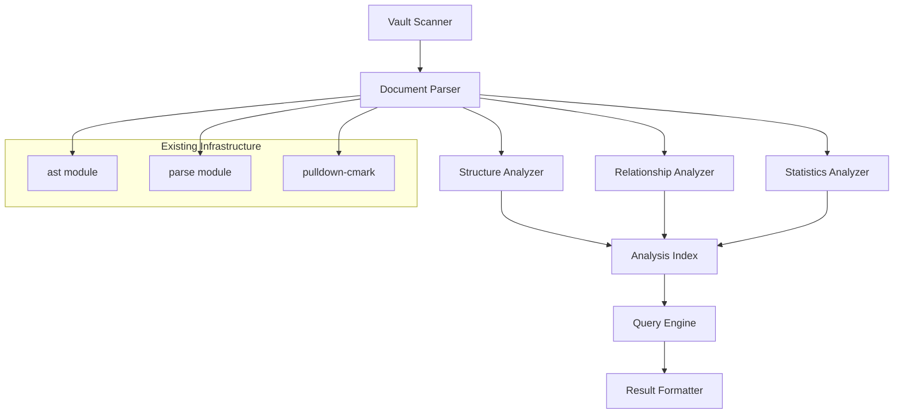

# Design Document

## Overview

The vault-analysis-tools feature provides comprehensive structural analysis and querying capabilities for markdown document collections. It builds upon the existing AST and parsing infrastructure to extract document hierarchies, map relationships, and provide powerful query interfaces. The design emphasizes performance, modularity, and extensibility to support both CLI usage and programmatic integration.


### Modular Design Principles
- **Single File Responsibility**: Each analysis type (structure, relationships, statistics) in separate modules
- **Component Isolation**: Analysis engines independent of output formatting and query interfaces
- **Service Layer Separation**: Clear boundaries between data extraction, analysis computation, and result presentation
- **Utility Modularity**: Focused utilities for link parsing, heading extraction, and relationship mapping



## Link Resolution Strategy

Two-phase approach leveraging existing AST infrastructure:

```rust
// Phase 1: Extract referenceable targets from all files
struct ReferenceableItem {
    file_path: PathBuf,
    item_type: ReferenceType,
    identifier: String,
}

enum ReferenceType {
    File,           // "filename" (without .md extension)
    Heading,        // "heading text" with file context
}

// Phase 2: Resolve references using Obsidian rules
fn resolve_links(
    references: Vec<ParsedLink>,
    targets: Vec<ReferenceableItem>
) -> (Vec<ResolvedLink>, Vec<BrokenLink>)
```

**Resolution Rules:**
- `[[filename]]` → exact filename match (case-sensitive)
- `[[#heading]]` → first similar heading in same file
- `[[## keyword]]` → headings containing keyword across vault
- `[text](filename%20with%20spaces.md)` → percent-decoded exact match