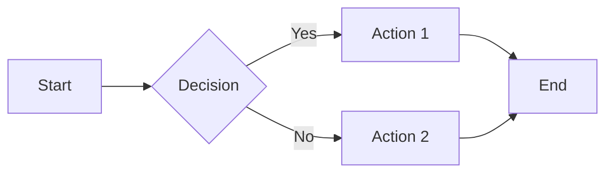

# Mixed Diagrams

This note contains both TikZ and Quiver diagrams, along with mermaid.

## Mermaid Flowchart



## TikZ State Machine

```tikz
\begin{tikzpicture}[
    state/.style={circle, draw, minimum size=1.2cm},
    ->, >=stealth
]
    \node[state] (s0) at (0,0) {$s_0$};
    \node[state] (s1) at (3,0) {$s_1$};
    \node[state] (s2) at (1.5,-2) {$s_2$};

    \draw (s0) edge[bend left] node[above] {a} (s1);
    \draw (s1) edge[bend left] node[below] {b} (s0);
    \draw (s0) edge node[left] {c} (s2);
    \draw (s2) edge[loop below] node {d} (s2);
\end{tikzpicture}
```

## Quiver Pullback

```quiver
\begin{tikzcd}
    P \arrow[r] \arrow[d] \arrow[dr, phantom, "\lrcorner", very near start] & X \arrow[d, "f"] \\
    Y \arrow[r, "g"] & Z
\end{tikzcd}
```

## Invalid TikZ (should fallback)

```tikz
this is not valid tikz code!!!
```

## Invalid Quiver (should fallback)

```quiver
also not valid quiver code!!!
```
